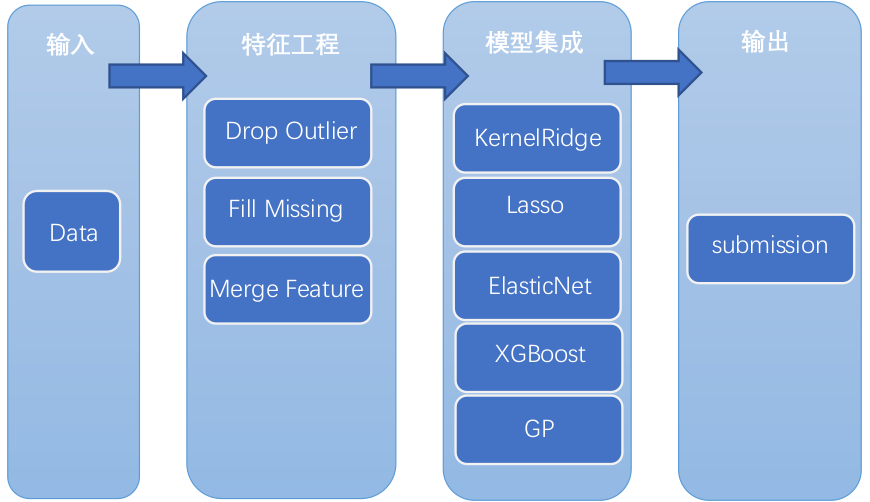

# House-Prices

## Final Result

- Offline cross validation: 0.10967,
- Online Leaderboard: 0.11475
- ranking:120

## Selected Models

|算法模型|XGBoost|Lasso|ElasticNet|KernelRidge|GaussianProcess|
|:----:|:------:|:---:|:--------:|:---------:|:-------------:|
|线下CV|0.11116|0.10977|0.10877|0.10747|0.10777|
|线上LB|0.11844|0.11755|0.11734|0.11695|0.11734|

## Pipline

## Function/Code
1. Data Exploration.ipynb – jupyter notebook for data analysis
2. preprocess.py – data preprocess and feature engineering
3. models.py – functions about models, include loss function's definition, evaluate single model and two ensemble methods
4. gride_search.py – use grid search to adjust the models' parameters
5. ensemble.py – define the algorithm models and ensemble them to output the submission result
